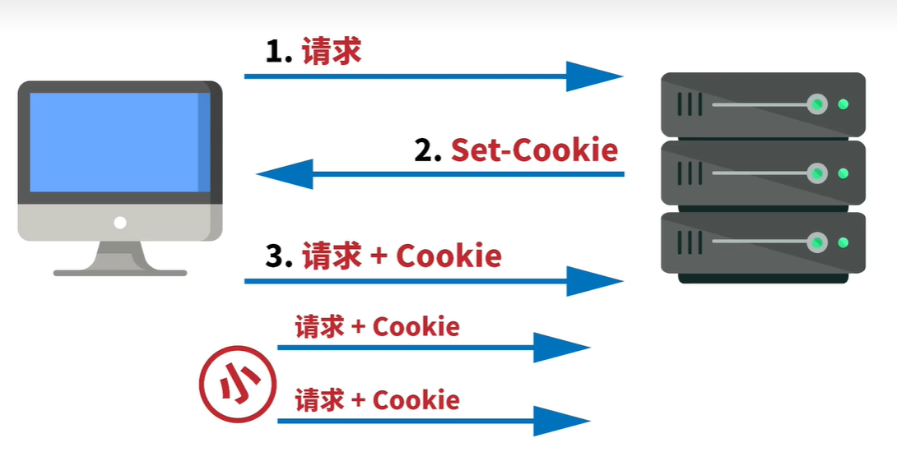
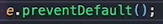
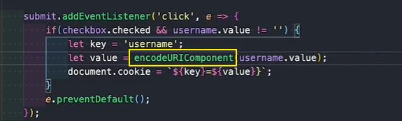
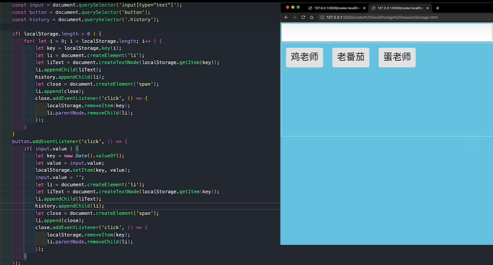
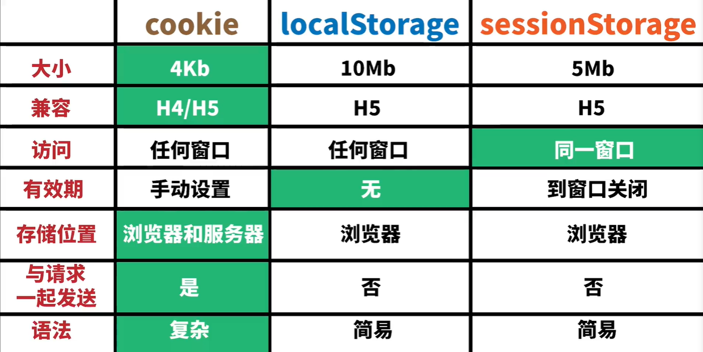
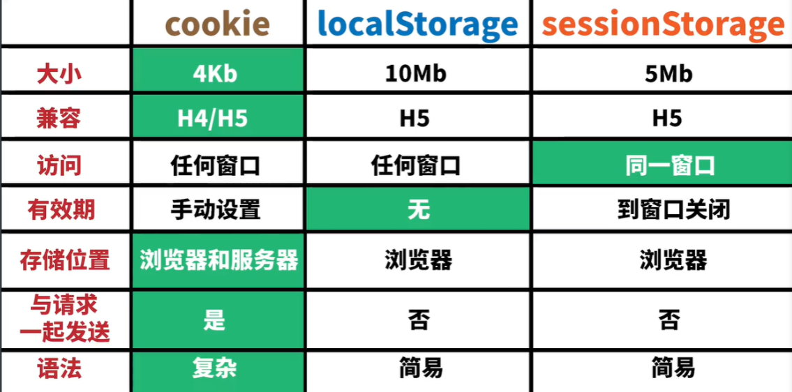
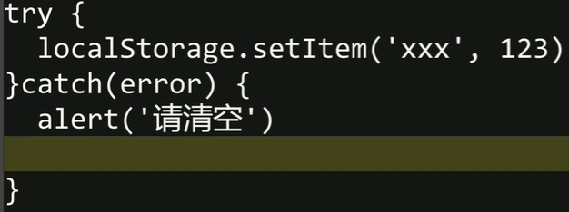
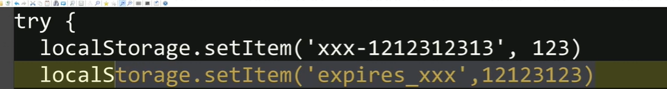

#### Cookie V.S. LocalStorage

1. 主要区别是 Cookie 会被发送到服务器，而 LocalStorage 不会
2. Cookie 一般最大 4k，LocalStorage 可以用 5Mb 甚至 10Mb（各浏览器不
同）

#### LocalStorage V.S. SessionStorage

1. LocalStorage 一般不会自动过期（除非用户手动清除）
2. SessionStorage 在回话结束时过期（如关闭浏览器之后，具体由浏览器自行
决定）

#### Cookie V.S. Session

1. Cookie 存在浏览器的文件里，Session 存在服务器的文件里
2. Session 是基于 Cookie 实现的，具体做法就是把 SessionID 存在 Cookie 里

#### 怎么理解HTTP是无状态的

- 登录网站后输入用户名和密码
- 第二次登录以后，服务器又不知道了

Cookie的出现，是为了解决什么问题

- 为了解决HTTP无状态
- 存储机制

为什么Cookie设置的比较小？

- 因为发明的早，那时候带宽紧张

#### 它的作用是什么

- 阻止默认行为

#### 是什么类型

#### 怎么解决编码问题？

- 

#### sessionStorage什么时候被删除

- 关闭浏览器就被删除

#### localStorage什么时候被删除

- 手动清除
- 但不参与服务器通信
- 同步的机制，影响浏览器的渲染进度

#### valueOf的作用是什么

#### 怎么创造节点，并添加到li里面

#### cookie、localStorage、sessionStorage在大小方面的区别是什么

cookie、localStorage、sessionStorage在兼容方面的区别是什么

cookie、localStorage、sessionStorage在访问方面的区别是什么

cookie、localStorage、sessionStorage在有效期方面的区别是什么

cookie、localStorage、sessionStorage在【与请求一起发送】位置方面的区别是什么

cookie、localStorage、sessionStorage在语法方面的区别是什么

#### localStorage如果超过10M怎么办？

- 
- 让它

#### 前端需要操作cookie吗？

- 不需要 

#### LocalStorage如果过期怎么办？

- 加个时间戳
- 

#### 怎么给localStorage创造时间戳？

#### TS 和 JS 的区别是什么？有什么优势？

Vuex

Vue-router

webpack（还没学）

输入URL回车后的过程

http的一些别的

Vue原理

Vue路由守卫

数组排序

ES6新特性

- 接受固执
- class
- module

CSS3新特性

浏览器缓存就是HTTP缓存

说一说SessionStorage和localStorage还有cookie

