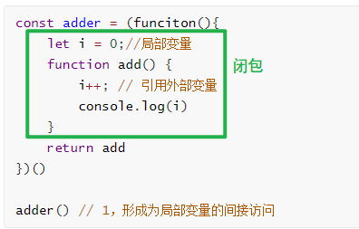

# JS的闭包是什么，怎么用

## 闭包的定义

在非全局环境中，[函数」和「函数内部能访问到的外部变量」的总和，就是闭包



```javascript
const adder = (funciton(){
	let i = 0;//局部变量
	function add() {
		i++; // 引用外部变量
		console.log(i)
	}
	return add
})()

adder() // 1，形成为局部变量的间接访问
```


#### 什么是非全局环境呢

- 在函数体内

```javascript
function fn() {
    let i = 0;//i是局部变量（本地变量）
}
```

- 在块级作用域内+let定义的变量

```javascript
{
    let i = 0; // 自由变量
}
console.log(i);//undefined
```

- 在立即执行函数内

```javascript
(funciton(){
 let i = 0;//自由变量
 }())
console.log(i); // undefined
```

#### 为什么要在非全局环境中呢

- 因为闭包的作用是为了避免全局污染，形成对局部变量的间接访问
- 如果外部的变量本就是全局变量，那么这个变量本来就能访问，闭包的意义也就不存在了

```javascript
var i = 0; // i是全局变量
function fn() {
    console.log(i)
}
console.log(i) // 1，我们本来就可以对其进行访问
```

## 闭包的作用

- 避免全局变量污染（因为函数引用的变量是局部变量）
- 形成对局部变量的间接访问
  - 隐藏变量，暴露访问器
- 维持变量，使其不被垃圾回收（立即执行函数后，变量依旧维持着）

## 闭包的缺点

- 如果使用不当，那么会导致内容泄露。
  - 不再用到的内存，没有及时释放，就叫做内存泄漏。
  - 闭包会使得函数中的变量都保存在内存中，内存消耗很大，所以不能滥用闭包，否则会造成网页的性能问题
    在退出函数之前，将不使用的局部变量全部删除
- 部分浏览器对闭包的支持不够好

```javascript
const x =  function() {
    let a = 1;
    let b = 2;
    function fn() {
        return b
    }
    return fn
})
const fn = x();
const result = fn();//得到b的值，也就是2
这时候a应该被垃圾回收了，因为函数已经执行完毕，我也并没有使用到它。但旧版本IE的问题，导致a继续保留着，这就造成了额外的内存泄露

```

- 所以我们要尽量慎用，少用闭包

## 容易被坑的闭包题目

#### 循环与闭包

```javascript
for (var i=0;i<=5;i++) {
    setTimeout(function timer() {
        console.log(i)
    },1000*i)
};// 得到的结果是什么，为什么，怎么修改
```

- 关键点：延迟函数的回调会在循环结束后才执行
- 尽管循环中的5个函数是在各个迭代中分别定义的，但是他们都被封闭在了一个共享的全局作用域中，因此只有一个`i`，而当整个循环结束后，这个`i`值变成了6，所以最终的结果输出了6个6

#### 办法一：

- 所以我们需要在每个迭代都创建一个局部的作用域，但这样做，只是创建了局部作用域，并没有对`i`值进行任何操作，

```javascript
for (var i = 0; i <= 5; i++) {
  (function () {
    console.log("works");
    setTimeout(function timer() {
      console.log(i);
    }, 0);
  })();
}
```

- 所以我们需要把`i`值作为匿名函数的参数，传给它，然后在匿名函数中修改下参数名，这样就能够正常实现了

```javascript
for (var i = 0; i <= 5; i++) {
  (function (j) {
    console.log("works");
    setTimeout(function timer() {
      console.log(j);
    }, 0);
  })(i);
}
```

#### 办法二：

- 更简单的方式，用let创造变量，跟for循环的块级作用域形成一个局部变量

```
for (var i = 0; i <= 5; i++) {
	let j = i;
    setTimeout(function timer() {
      console.log(j);
    }, 0);
  }
}
```

- 再次简化，直接放到()中

```
for (let i = 0; i <= 5; i++) {
    setTimeout(function timer() {
      console.log(i);
    }, 0);
  }
}
```


## 其他补充

#### JavaScript中有哪几种变量？

- 自由变量
  - 立即执行函数中的变量或者块级作用域中let声明的变量
- 全局变量
- 本地变量（局部变量）
  - 函数中的变量

