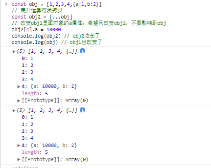
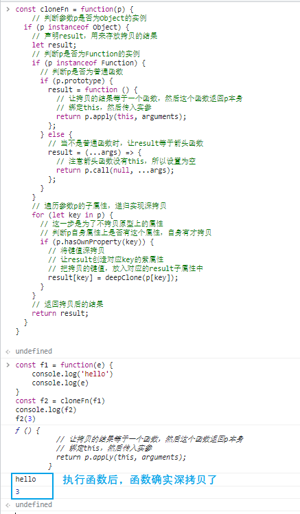

## 浅拷贝的几种方式

```javascript
const obj = [1,2,3,4,{a:1,b:2}]
const obj2 = [...obj]
const obj3 = Object.assign([],obj)
const obj4 = obj.slice(0)
const obj5 = obj.concat()
```

## 为什么需要用到深拷贝？

```javascript
const obj = [1,2,3,4,{a:1,b:2}]
// 展开运算符浅拷贝
const obj2 = [...obj]
// 改变obj2里面对象的a属性，希望只改变obj2，不要影响到obj
obj2[4].a = 10000 
console.log(obj2) // obj2改变了
console.log(obj) // obj1也改变了

```




## 深拷贝有哪些要点？

-   判断要拷贝的类型

-   递归拷贝子属性

    -   只拷贝自身的属性，不拷贝原型上的属性

-   解决循环引用问题

## 如何深拷贝函数？

- 判断类型
  - 是否为对象
  - 是否为函数
  - 是普通函数还是箭头函数

```javascript
const cloneFn = function(p) {
    // 判断参数p是否为Object的实例
  if (p instanceof Object) {
    // 声明result，用来存放拷贝的结果
    let result;
    // 判断p是否为Function的实例
    if (p instanceof Function) {
      // 判断p是否为普通函数
      if (p.prototype) {
        result = function () {
          // 让拷贝的结果等于一个函数，然后这个函数返回p本身
          // 绑定this，然后传入实参
          return p.apply(this, arguments);
        };
      } else {
        // 当不是普通函数时，让result等于箭头函数
        result = (...args) => {
          // 注意箭头函数没有this，所以设置为空
          return p.call(null, ...args);
        };
      }
    } 
    // 遍历参数p的子属性，递归实现深拷贝
    for (let key in p) {
      // 这一步是为了不拷贝原型上的属性
      // 判断p自身属性上是否有这个属性，自身有才拷贝
      if (p.hasOwnProperty(key)) {
        // 将键值深拷贝
        // 让result创造对应key的紫属性
        // 把拷贝的键值，放入对应的result子属性中
        result[key] = deepClone(p[key]);
      }
    }
    // 返回拷贝后的结果
    return result;
  }
}


```

## 如何拷贝Object构造出来的类型

#### 有哪些常见的用Object构造出来的类型？

-   `Date`

-   `RegExp`

-   函数

    -   箭头函数（没有prototype属性）
    -   普通函数（有prototype属性）

-   普通对象

#### 实现

```javascript
const deepClone = function (p) {
  // 判断参数p是否为Object的实例
  if (p instanceof Object) {
    // 声明result，用来存放拷贝的结果
    let result;
    // 判断p是否为Function的实例
    if (p instanceof Function) {
      // 判断p是否为普通函数
      if (p.prototype) {
        result = function () {
          // 让拷贝的结果等于一个函数，然后这个函数返回p本身
          // 绑定this，然后传入实参
          return p.apply(this, arguments);
        };
      } else {
        // 当不是普通函数时，让result等于箭头函数
        result = (...args) => {
          // 注意箭头函数没有this，所以设置为空
          return p.call(null, ...args);
        };
      }
    } else if (p instanceof Array) {
      result = [];
    } else if (p instanceof Date) { //判断是否为时间
      // 把时间转化成数字（时间戳）
      result = new Date(+p); 
    } else if (p instanceof RegExp) { // 判断是否为正则
      //返回一个新的正则
      result = new RegExp(p.source, p.flags);
    } else {
        // 其他的情况，返回一个普通的对象
        return {}
    }
    // 遍历参数p的子属性，递归实现深拷贝
    for (let key in p) {
      // 这一步是为了不拷贝原型上的属性
      // 判断p自身属性上是否有这个属性，自身有才拷贝
      if (p.hasOwnProperty(key)) {
        // 将键值深拷贝
        // 让result创造对应key的紫属性
        // 把拷贝的键值，放入对应的result子属性中
        result[key] = deepClone(p[key]);
      }
    }
    // 返回拷贝后的结果
    return result;
  }
};
```

## 实现除了Object之外的其他类型的拷贝

-   其他的基础类型，等于其自身就可以了

```javascript
const deepClone = function (p) {
  if (p instanceof Object) {
    let result;

    if (p instanceof Function) {
      if (p.prototype) {
        result = function () {
          return p.apply(this, arguments);
        };
      } else {
        result = (...args) => {
          return p.call(null, ...args);
        };
      }
    } else if (p instanceof Array) {
      result = [];
    } else if (p instanceof Date) {
      result = new Date(+p);
    } else if (p instanceof RegExp) {
      result = new RegExp(p.source, p.flags);
    } else {
        return {}
    }
    
    for (let key in p) {
      if (p.hasOwnProperty(key)) {
        result[key] = deepClone(p[key]);
      }
    }

    return result;
  } else {
    // 其他的基础类型，等于其自身就可以了
    result = p;
    return result
  }
};

for (let key in result) {
    if(p.hasOwnProperty(key)) {
        result[key] = cloneDeep(p[key])
    }
}
```

## 目前这样做的缺点是什么？

-   当要复制的参数p，它的子属性是其自身时，会出现调用栈溢出的问题
-   a.self = a
-   也就是循环引用的问题


-   为什么会出现问题

#### 什么是循环引用，用图表示下

-   如果a对象有个self属性指向其自身

<!---->

-   


#### 怎么解决循环引用的问题

-   对象的属性直接的引用了自身的情况

-   以额外开辟一个存储空间，来存储当前对象和拷贝对象的对应关系

    -   Map的键名可以是对象
    -   

-   当需要拷贝当前对象时，先去存储空间中找，有没有拷贝过这个对象

    -   如果发现要拷贝的内容，已经拷贝过了，直接返回
    -   如果没有的话继续拷贝，这样就巧妙化解的循环引用的问题

```javascript
const deepClone = (a, cache) => {
  if (!cache) {
      // 注意这里要用var，因为其他的地方也需要用到它
    var cache = new Map(); // 临时创建并递归传递
  }
  if (a instanceof Object) {
    // 如果要拷贝的内容，已经拷贝过了，直接返回
    if (cache.get(a)) return cache.get(a);

    let result;
    if (a instanceof Function) {
      if (a.prototype) {
        // 有 prototype 就是普通函数
        result = function () {
          return a.apply(this, arguments);
        };
      } else {
        result = (...args) => {
          return a.call(undefined, ...args);
        };
      }
    } else if (a instanceof Array) {
      result = [];
    } else if (a instanceof Date) {
      result = new Date(a - 0);
    } else if (a instanceof RegExp) {
      result = new RegExp(a.source, a.flags);
    } else {
      result = {};
    }
    // 如果没有拷贝过这个对象，那么就将当前对象作为key，克隆对象作为value进行存储
    cache.set(a, result);

    // 递归深克隆
    for (let key in a) {
      // 判断key是否在其自身上
      if (a.hasOwnProperty(key)) {
        result[key] = deepClone(a[key], cache); // 递归传递，注意这时把cache也传过去了
      }
    }
    return result;
  } else {
    return a;
  }
};
```

#### 代码测试

```javascript
const a = {
  number: 1,
  bool: false,
  str: "hi",
  empty1: undefined,
  empty2: null,
  array: [
    { name: "frank", age: 18 },
    { name: "jacky", age: 19 },
  ],
  date: new Date(2000, 0, 1, 20, 30, 0),
  regex: /.(j|t)sx/i,
  obj: { name: "frank", age: 18 },
  f1: (a, b) => a + b,
  f2: function (a, b) {
    return a + b;
  },
};


a.self = a
const b = deepClone(a)
b.self === b // true
b.self = 'hi'
a.self !== 'hi' //true

const f1 = function(e) {
    console.log('hello')
    console.log(e)
}

f1.pro1 = 1
f1.pro2 = 2

const f2 = deepClone(f1)
console.dir(f2)
f2(3) // 'hello' 3


```

