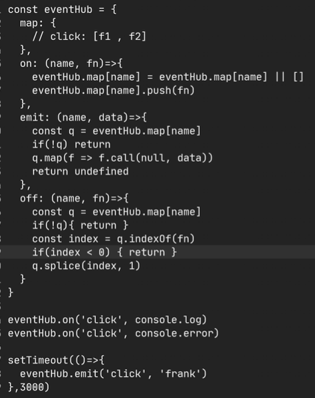

# 手写发布订阅


设计模式翻译成大白话是什么？

- 就是套路
- 就是某种处理方式


## 手写发布订阅中，需要有那几个内容

- 哈希表
  - 用来存放任务队列们
- on监听事件
  - 将任务添加到任务队列中
- off取消事件
  - 将任务从任务队列中取消
- emit
  - 触发任务队列


on要做的事情是什么？

- 判断任务队列名（函数）是否存在于哈希表中

  - 如果不存在，将其设置为一个空数组

- 然后将任务放入任务队列中

  

- 放到任务队列里面
  - 任务队列里面的任务是什么？
    - 函数就是任务
  - 任务队列为什么是队列？
    - 任务就是函数
    - 比如监听多个函数，那么就需要有顺序
    - 先进先出（爬管子）

- 可能会有多个队列，比如click队列，hover队列，mouse Up对象等等


不同的name，对应不同的数组，这叫做什么？

- 映射
- hash Map
- JS中如何表示一个哈希表？
  - 用空对象


什么是防御式编程

- 如果出错了怎么办


改成


找到队列，然后往队列中存放内容


别名


别名最好只进行读操作，不进行写操作


emit要做的事情是什么

- 找到需要的那个任务队列
- 然后执行队列中的函数




off要做的是什么

- 找到任务队列
- 找到需要取消的那个函数在对应任务队列中的位置
- 然后将那个函数从任务队列中移除

```javascript
const eventHub = {
  hashMap: {},
  on(name, fn) {
    // 如果任务队列不存在，就让这个任务队列等于一个空数组
    if (!eventHub.hashMap[name]) {
      eventHub.hashMap[name] = [];
    }
    // 往任务队列中添加任务
    eventHub.hashMap[name].push(fn);
  },
  off(name, fn) {
    // 找到任务队列
    const q = eventHub.hashMap[name];
    // 如果这个任务队列不存在就返回
    if (!q) return;
    // 在任务队列中，找到相同的任务
    let index = q.indexOf(fn);
    // 如果没有找到，就直接返回
    if (index === -1) return;
    // 如果这个任务队列中，有这个函数，那么就将其从队列中删除
    q.splice(index, 1);
  },
  emit(name, data) {
    const q = eventHub.hashMap[name];
    if (!q) return;
    q.forEach((fn) => {
      fn(data); // fn.call(undefined,data)
    });
  },
};

eventHub.on("click", function (e) {
  console.log("点击了一下", e);
});

eventHub.on("click", function (e) {
  console.log("点击了第二下", e);
  console.error;
});

setTimeout(() => {
  eventHub.emit("click", "传入的数据");
}, 3000);
```

## 用class手写

```javascript
class EventHub {
  hashMap = {};
  on(name, fn) {
    // 如果任务队列不存在，就让这个任务队列等于一个空数组
    if (!this.hashMap[name]) {
      this.hashMap[name] = [];
    }
    // 往任务队列中添加任务
    this.hashMap[name].push(fn);
  }
  off(name, fn) {
    // 找到任务队列
    const q = this.hashMap[name];
    // 如果这个任务队列不存在就返回
    if (!q) return;
    // 在任务队列中，找到相同的任务
    let index = q.indexOf(fn);
    // 如果没有找到，就直接返回
    if (index === -1) return;
    // 如果这个任务队列中，有这个函数，那么就将其从队列中删除
    q.splice(index, 1);
  }
  emit(name, data) {
    const q = this.hashMap[name];
    if (!q) return;
    q.forEach((fn) => {
      fn(data); // fn.call(undefined,data)
    });
  }
}

const x = new EventHub();
x.on("click", console.error);
x.on("click", console.log);
x.off("click", console.error);
```

## 知识补充

#### splice

-  splice() 方法通过删除或替换现有元素或者原地添加新的元素来修改数组
- 以数组形式返回被修改的内容
- 此方法会改变原数组。

####  `indexOf()`方法

- 返回在数组中可以找到一个给定元素的第一个索引
- 如果不存在，则返回-1。


```javascript
const eventHub = {
    hashMap:{},
    on(name,fn) {
        if(!eventHub.hashMap[name]) {
            eventHub.hashMap[name] = []
        }
        eventHub.hashMap.push(fn)
    },
    off(name,fn) {
        const q = eventHub.hashMap[name]
        if(!q) return
        const index = q.indexOf(fn)
        if(index < 0) return
        q.splice(index,1)
    },
    emit(name,data) {
        const q = eventHub.hashMap[name]
        if(q) return
        q.forEach(fn => {
            fn(data)
        })
    }
}
```


