什么是nextTick 

什么在做事件循环

##### 有了 event loop 的加持，Node.js能进行什么操作

- 有了 event loop 的加持，Node.js 才可以非阻塞地执行 I/O 操作
- 把这些操作尽量转移给操作系统来执行

##### 当 Node.js 启动时，会做哪几件事

1. 初始化 event loop
2. 开始执行脚本。这些脚本有可能会调用一些异步 API、设定计时器或者调用 process.nextTick()
3. 开始处理 event loop

##### process.nextTick()的作用是什么

- 控制代码执行顺序

##### 如何处理event loop呢，想想概念图

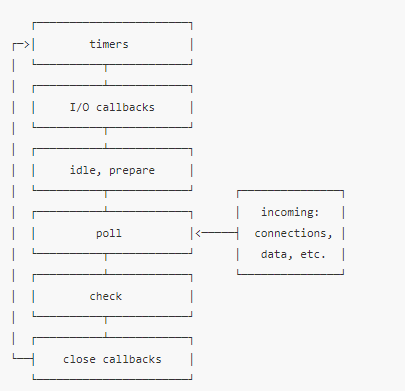

https://juejin.cn/post/6844903582538399752#heading-12

##### 什么是Event Loop

##### setTimeout的结果是什么呢

- 它是一个webApi

##### 函数执行完毕后，会从调用栈中移除吗

- 会

##### 什么时候Event Loop会登场

- 所有同步任务执行完以后

#### Event Loop的作用是什么

- Event Loop 会把回调队列（callback queue）中的任务，放入到调用栈(call stack)中

- 不断循环查找Callback Queue里面有没有回调函数
- 有的话，并且调用栈为空的话，就放到调用栈之中

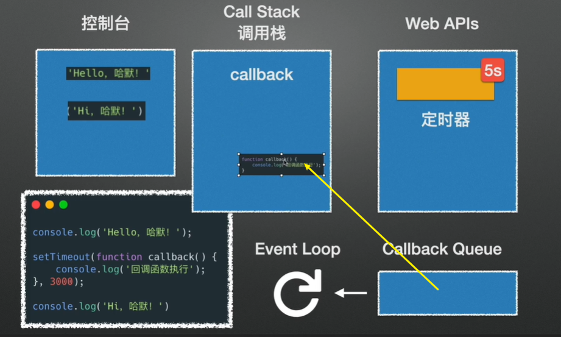

##### 这个回调函数，什么时候放到Callback Queue当中？

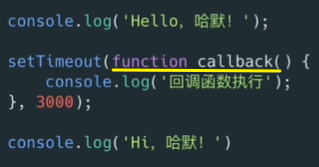

- 计时器到了以后才放到任务队列中
- 如果任务队列为空，且调用栈为空，那么就放到调用栈当中
- 然后再执行函数

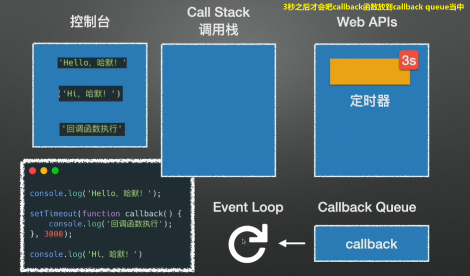

有哪些宏任务（普通的异步程序）

有哪些微任务

宏任务和微任务谁先执行？

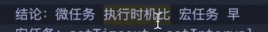

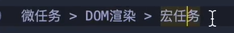

为什么微任务先执行

因为在宏任务跟微任务之间隔了一个DOM渲染

用什么可以阻断JS的执行？

- alert

##### 这个函数能在浏览器中执行吗？

- 不行，只能在Node.js中运行

##### 它是在什么时候执行？

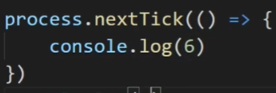

- 同步代码执行之后
- 异步代码执行之前

##### 执行的顺序是什么？

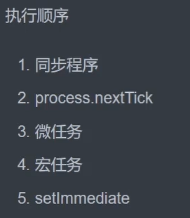

##### setImmediate在JS顺序中的哪个位置？

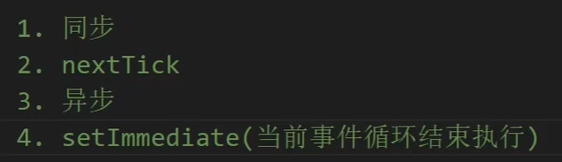

- 异步程序的后面

#### 同步的代码，直接放到哪里执行？

- 直接放到调用栈（运行栈）中执行

#### 异步任务放在哪里？

- 放在callback queue中执行（也就是任务队列）

什么时候将任务队列放到里面 

#### 用大白话说事件循环的作用

- 就是不断检测任务队列(callback queue)里面有没有任务
- 如果有任务就执行
- 如果有多个任务，那么就要按顺序执行

#### 计时器的作用是什么

- 到点之后，把任务放到任务队列里面

#### 输出的结果是什么，为什么

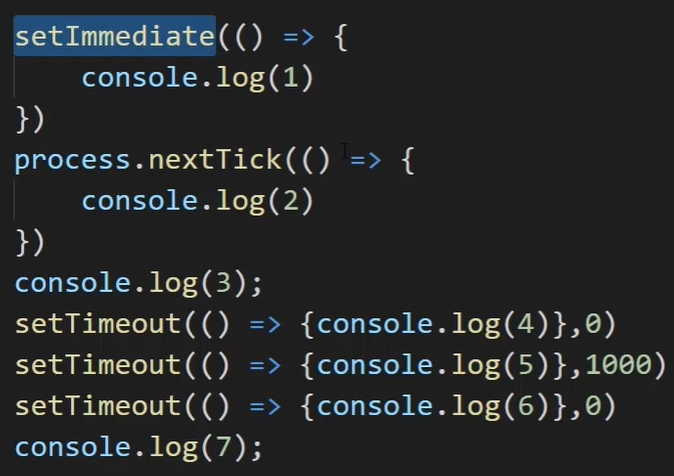

- 3724615
- 因为黄色区域是下一次循环
- 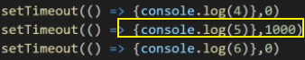

#### 任务队列是否执行，取决于什么？

- 取决于call stack（运行栈/调用栈）中是否为空（也就是同步任务是否都执行完了）

#### 怎么判断当前事件循环是否结束呢

- 比如两个计时器都是0秒后执行
- 而另一个计时器是1秒后执行
- 那么最后这个就是后面的一次循环了
- 在这之前，就已经有过一次setImmediate了

#### 哪些是宏任务

- 计时器（setTimeout/setInterval)
- ajax（前后端数据交互）
- 读取文件
- DOM事件

#### 哪些是微任务

- promise.then

#### 异步任务里面，宏任务和微任务哪个先执行

- 先执行微任务
- 再执行宏任务

#### 这道题的输出顺序是什么

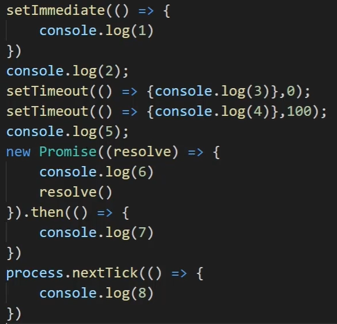

- 25687314
- 注意new Promise是同步任务
- 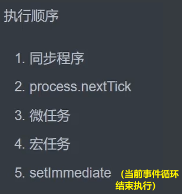

请描述一下display:

#### display 都有哪些属性

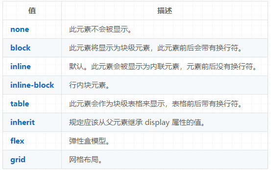

#### 如果想要其中一个请求出错了但是不返回结果怎么办

- 使用 Promise.allSettled

#### Ajax的最大优势是什么？

- 页面无刷新获取数据

#### 为什么要学习async函数？

#### async函数的返回值是什么

- Promise对象
- 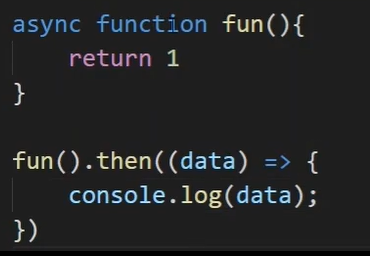

#### 这段代码如果要改写成async，怎么改

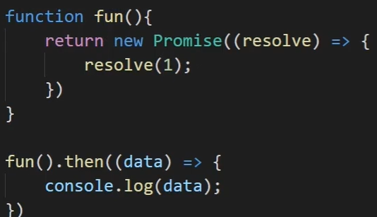

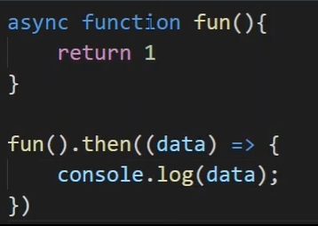

#### 怎么直接拿到一个resolve的值？

- 用await（但必须在async函数里面）

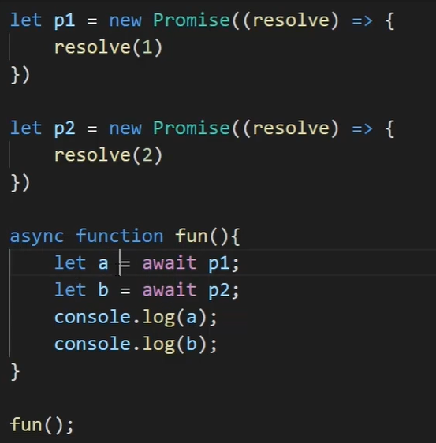

#### 这里会输出什么？

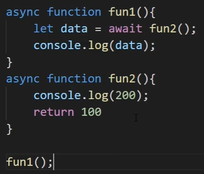

- 200、100

