## 

## 

## Vue生命周期有 哪些

Vue 的生命周期钩子核心实现是

利用发布订阅模式先把用户传入的的生命周期钩子订阅好（内部采用数组的方式存储）

然后在创建组件实例的过程中会一次执行对应的钩子方法（发布）。

#### 说一下beforeCreate[done]

`beforeCreate`：

是 `new Vue()` 之后触发的第一个钩子，

在当前阶段 `data`、`methods`、`computed` 以及 `watch` 上的数据和方法都不能被访问。

beforeCreate在什么时候发生d

- 是 new Vue() 之后触发的第一个钩子
- 在当前阶段data、methods、computed以及watch上的数据和方法都不能被访问。

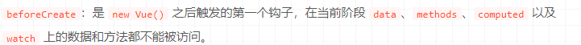

#### 说一下created阶段【done】

`created`：

在实例创建完成后发生，

当前阶段已经完成了数据观测，也就是可以使用数据，更改数据，

在这里更改数据不会触发 `updated` 函数。

可以做一些初始数据的获取，

在当前阶段无法与 `Dom` 进行交互，如果非要想，可以通过 `vm.$nextTick` 来访问 `Dom`

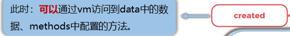

- created阶段，在实例创建完成后发生
- 这个阶段已经完成了数据观测
- created阶段，可以使用数据，更改数据
- created阶段，在这里更改数据不会触发updated 函数
- created阶段，可以做一些初始数据的获取，
- 在当前阶段无法与 Dom 进行交互，如果非要想，可以通过 `vm.$nextTick` 来访问 Dom。

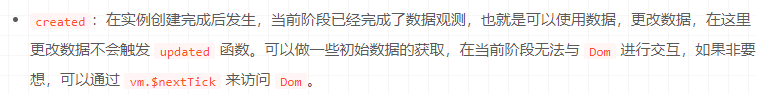

### 说一下beforeMount阶段【done】

- 发生挂载之前

- 虚拟 Dom 已经创建完成，即将开始渲染。
- 在此时也可以对数据进行更改，不会触发 updated

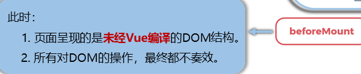

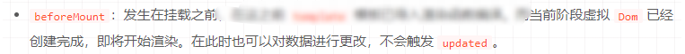

#### 发生在什么时候

- new Vue()之后的第一个钩子

#### beforeMount阶段，页面呈现的是什么？

- 未经编译的DOM结构

#### beforeMount阶段，对DOM的操作生效了吗

- 所有对DOM的操作，最终都不奏效

#### beforeMount阶段，这个阶段不会触发什么？

- updated函数

#### 说一下mounted【done】

mounted：

在挂载完成后发生，

在当前阶段，真实的 Dom 挂载完毕，

数据完成双向绑定，

可以访问到 Dom 节点，

使用 $refs 属性对 Dom 进行操作。

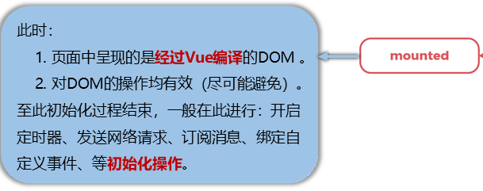

- 什么时候发生
  - 在挂载完成后发生
- 在当前阶段，什么东西挂在完毕了
  - 真实的 Dom 挂载完毕
- 数据完成了什么
  - 双向绑定
- mounted阶段，可以访问到DOM节点吗
  - 可以
- mounted阶段，使用什么对DOM进行操作
  - $refs

- 说一下经常在mounted部分进行的操作

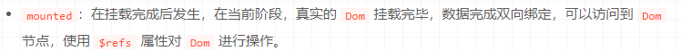

#### 说一下beforeUpdate【done】

beforeUpdate：

- 发生在更新之前，

- 响应式数据发生更新，虚拟 dom 重新渲染之前被触发

- 你可以在当前阶段进行更改数据，不会造成重新渲染

- beforeUpdate阶段，数据是新的吗
  - 新的
- beforeUpdate阶段，页面是新的吗
  - 旧的

- beforeUpdate阶段，什么更新了
  - 响应式数据更新了
- beforeUpdate阶段，你可以进行什么？
  - 更改数据
- beforeUpdate阶段，更改数据，会造成重新渲染吗
  - 不会

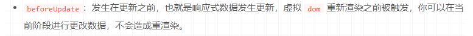

#### 说一下updated【done】

updated：

发生在更新完成之后，

当前阶段组件 Dom 已完成更新。

要注意的是避免在此期间更改数据，因为这可能会导致无限循环的更新

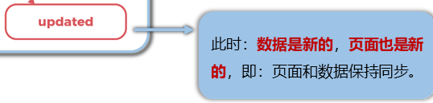

- updated阶段，数据是新的吗
- updated阶段，页面是新的吗
- updated阶段，什么已完成更新
  - 数据，页面，组件DOM
- updated阶段，如果更改了数据，可能会造成什么问题
  - 避免在此期间更改数据，因为这可能会导致无限循环的更新

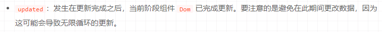

#### 说一下beforeDestroy[done]

beforeDestroy：

发生在实例销毁之前，

在当前阶段实例完全可以被使用，

我们可以进行一些收尾事件，比如清除计时器。

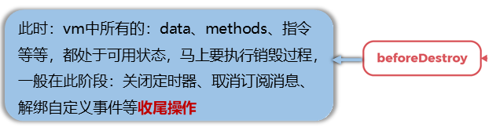

- beforeDestroy阶段，哪些东西可以用
  - data/methods/指令等
- beforeDestroy阶段，马上要执行什么过程
  - 销毁过程
- beforeDestroy阶段，一般进行哪些收尾事件？
  - 关闭定时器
  - 取消订阅消息
  - 解绑自定义事件等
- beforeDestroy阶段，实例可以还被使用吗
  - 可以

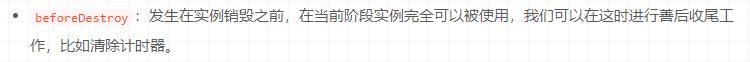

生命周期钩子的 `this` 上下文指向什么

- 调用它的 Vue 实例

vm (ViewModel 的缩写) 这个变量名表示什么？

- Vue 实例

#### destoryed【done】

- `destroyed`：

发生在实例销毁之后，

这个时候只剩下了 `dom` 空壳。

组件已被拆解，数据绑定被卸除，监听被移出，子实例也统统被销毁。

- destoryed阶段，发生在什么时候
  - 实例销毁之后
- destoryed阶段，剩下了什么
  - dom空壳
- destoryed阶段，数据绑定怎么样了，监听怎么样了，子实例怎么样了
  - 数据绑定被卸除，监听被移出，子实例全部被被销毁

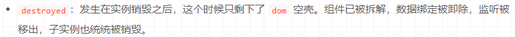
